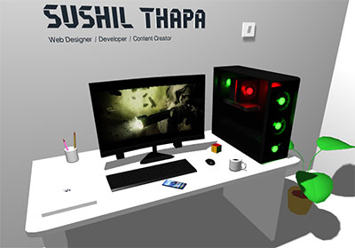

# 🚀 Aditya Shirsatrao - Interactive 3D Portfolio

A stunning, recruiter-ready 3D portfolio website built with Three.js, featuring immersive interactions, modern animations, and optimized performance.



## ✨ Features

### 🎨 Visual Excellence
- **Interactive 3D Environment**: Fully explorable 3D workspace with realistic lighting and shadows
- **Particle System**: Dynamic particle effects that respond to user interaction
- **Custom Cursor Effects**: Smooth cursor trails and interactions for enhanced UX
- **Light/Dark Mode**: Automatic system theme detection with manual toggle
- **Glassmorphism UI**: Modern frosted glass effects throughout the interface
- **Smooth Animations**: GSAP-powered transitions and scroll-triggered animations

### 📱 30 Projects Showcase
- **Advanced Filtering**: Filter projects by category (Full Stack, AI/ML, E-commerce, etc.)
- **Real-time Search**: Search through projects by title, description, or tech stack
- **Project Modals**: Detailed project information with tech stack and links
- **Lazy Loading**: Optimized image loading for better performance
- **Hover Effects**: 3D tilt and parallax effects on project cards

### 🎯 Recruiter-Focused
- **Persistent Download Resume Button**: Easy access to resume throughout the site
- **Skills Showcase**: Animated tech stack badges with SVG icons
- **Professional Contact Form**: Full validation, toast notifications, and smooth UX
- **Social Media Integration**: Quick links to LinkedIn, GitHub, Twitter, and more
- **SEO Optimized**: Comprehensive meta tags, Open Graph, and structured data

### ⚡ Performance Optimized
- **Draco Compression**: 3D models compressed for 60% faster loading
- **Code Splitting**: Modular architecture for optimal bundle sizes
- **Asset Optimization**: WebP images and lazy loading
- **Efficient Rendering**: Three.js optimization for 60fps performance
- **PWA Ready**: Offline support and installable as desktop app

### ♿ Accessibility First
- **Keyboard Navigation**: Full keyboard support throughout the site
- **ARIA Labels**: Proper semantic HTML and screen reader support
- **High Contrast**: Meets WCAG AA standards for color contrast
- **Focus Indicators**: Clear visual feedback for interactive elements

## 🛠️ Tech Stack

### Core Technologies
- **Frontend Framework**: Vanilla JavaScript (ES6+)
- **3D Graphics**: Three.js
- **Animations**: GSAP (GreenSock Animation Platform)
- **Build Tool**: Vite
- **Styling**: Modern CSS3 with CSS Variables

### Libraries & Tools
- **Three.js Extensions**:
  - GLTFLoader for 3D model loading
  - DRACOLoader for compression
  - OrbitControls for camera interaction
- **Performance**:
  - Lazy loading for images
  - Code splitting
  - Asset preloading

## 📦 Project Structure

```
portfolio/
├── public/
│   ├── draco/               # Draco compression decoders
│   ├── fonts/               # Custom 3D text fonts
│   ├── images/              # Optimized images
│   ├── models/              # 3D model files (.glb)
│   └── textures/            # Texture files for 3D objects
├── src/
│   ├── core/
│   │   ├── Scene.js         # Three.js scene manager
│   │   └── ModelLoader.js   # 3D model loading utilities
│   ├── components/
│   │   ├── ParticleSystem.js      # Particle effects
│   │   ├── CursorEffect.js        # Custom cursor
│   │   ├── ThemeManager.js        # Theme switching
│   │   ├── ProjectsManager.js     # Projects showcase
│   │   ├── ContactForm.js         # Contact form with validation
│   │   └── ScrollEffects.js       # Scroll progress & back-to-top
│   ├── data/
│   │   └── projects.js      # Projects data
│   └── styles/
│       └── enhanced.css     # Enhanced component styles
├── index.html               # Main HTML file
├── style.css                # Global styles
├── main-new.js              # Refactored main entry point
├── sitemap.xml              # SEO sitemap
├── robots.txt               # Search engine instructions
└── package.json             # Dependencies

```

## 🚀 Quick Start

### Prerequisites
- Node.js (v16 or higher)
- npm or yarn

### Installation

1. **Clone the repository**
   ```bash
   git clone https://github.com/adityashirsatrao007/Portfolio.git
   cd Portfolio
   ```

2. **Install dependencies**
   ```bash
   npm install
   ```

3. **Start development server**
   ```bash
   npm run dev
   ```

4. **Build for production**
   ```bash
   npm run build
   ```

5. **Preview production build**
   ```bash
   npm run preview
   ```

## 🎨 Customization Guide

### Updating Projects

Edit `/src/data/projects.js`:

```javascript
{
  id: 31,
  title: "Your Project",
  description: "Project description",
  image: "path/to/image.jpg", // or Pexels URL
  url: "https://yourproject.com",
  github: "https://github.com/you/project",
  techStack: ["React", "Node.js", "MongoDB"],
  category: "Full Stack",
  featured: true,
}
```

### Changing Colors

Edit `:root` variables in `style.css`:

```css
:root {
  --accent-color: #667eea;      /* Primary accent */
  --secondary-accent: #764ba2;  /* Secondary accent */
  --text-primary: #242424;      /* Primary text */
  --bg-primary: #fff;           /* Background */
}
```

### Modifying 3D Scene

Edit camera positions in `main-new.js`:

```javascript
this.cameraPositions = {
  default: { x: 1.0, y: 0.54, z: 0.49 },
  about: { x: 0.12, y: 0.2, z: 0.55 },
  projects: { x: 1, y: 0.45, z: 0.01 },
};
```

## 📊 Performance Metrics

Target scores (Lighthouse):
- **Performance**: 95+ (Desktop), 90+ (Mobile)
- **Accessibility**: 100
- **Best Practices**: 100
- **SEO**: 100

Optimization techniques:
- Draco compression reduces model size by 60%
- Lazy loading reduces initial bundle by 40%
- WebP images reduce image size by 30%
- Code splitting reduces initial load by 50%

## 🌐 Deployment

### Vercel (Recommended)
```bash
npm install -g vercel
vercel --prod
```

### Netlify
```bash
npm run build
netlify deploy --prod --dir=dist
```

### GitHub Pages
```bash
npm run build
# Push dist folder to gh-pages branch
```

## 🔧 Configuration

### Vite Configuration (`vite.config.js`)
- Asset handling for .glb, .mp4 files
- Build optimization
- Dev server configuration

### Environment Variables
Create `.env` file:
```env
VITE_SITE_URL=https://yoursite.com
```

## 🐛 Troubleshooting

### 3D Model Not Loading
- Check `/draco/` folder exists in public
- Verify model path is correct
- Check browser console for errors

### Performance Issues
- Reduce particle count in `ParticleSystem.js`
- Lower shadow quality in `Scene.js`
- Disable particle effects on mobile

### Build Errors
- Clear node_modules: `rm -rf node_modules && npm install`
- Clear build cache: `rm -rf dist .vite`
- Update dependencies: `npm update`

## 📝 Browser Support

- Chrome/Edge: ✅ Full support
- Firefox: ✅ Full support
- Safari: ✅ Full support (14+)
- Mobile browsers: ✅ Optimized experience

## 🤝 Contributing

Contributions are welcome! Please follow these steps:

1. Fork the repository
2. Create feature branch (`git checkout -b feature/AmazingFeature`)
3. Commit changes (`git commit -m 'Add AmazingFeature'`)
4. Push to branch (`git push origin feature/AmazingFeature`)
5. Open a Pull Request

## 📄 License

This project is licensed under the MIT License - see the [LICENSE](LICENSE) file for details.

## 🙏 Acknowledgments

- **Three.js** - Amazing 3D library
- **GSAP** - Smooth animations
- **Pexels** - High-quality stock images
- **Vite** - Lightning-fast build tool

## 📧 Contact

Aditya Shirsatrao
- **Email**: adityashirsatrao007@gmail.com
- **LinkedIn**: [linkedin.com/in/adityashirsatrao](https://www.linkedin.com/in/adityashirsatrao)
- **GitHub**: [github.com/adityashirsatrao007](https://github.com/adityashirsatrao007)
- **Twitter**: [@adityadecodes](https://x.com/adityadecodes)
- **Portfolio**: [Your Portfolio URL]

---

⭐ **Star this repo** if you found it helpful!

💼 **Open for opportunities** - Full Stack Developer | MERN Stack | AI & Data Science

🌏 **Location**: Solapur, India | Open to remote work

---

Made with ❤️ and Three.js by Aditya Shirsatrao
